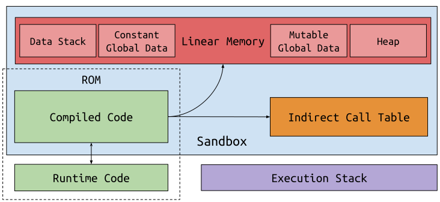
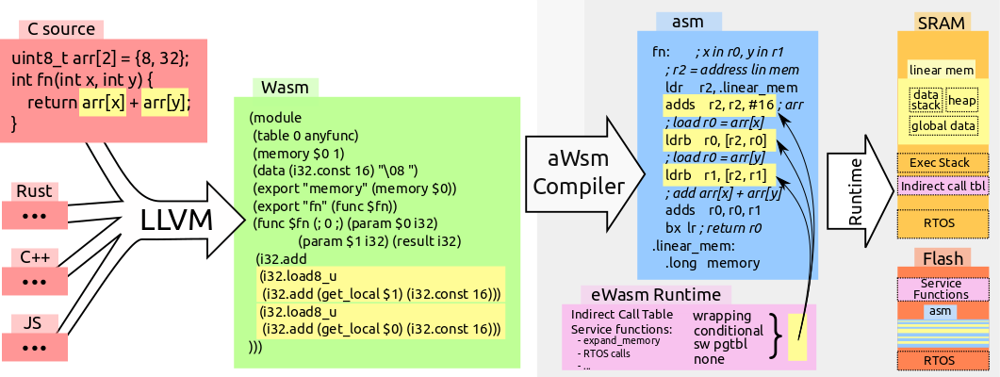

# aWsm Design

Here we briefly discuss the design of aWsm.
The intent isn't to be exhaustive, rather to give you a high-level understanding of the system.
Some gory details can be found in:

- [*Sledge: a Serverless-first, Light-weight Wasm Runtime for the Edge*](https://www2.seas.gwu.edu/~gparmer/publications/middleware20sledge.pdf) at ACM Middleware, 2020
- [*eWASM: Practical Software Fault Isolation for Reliable Embedded Devices*](https://www2.seas.gwu.edu/~gparmer/publications/emsoft20wasm.pdf) at EMSOFT, 2020

# Background: Wasm Sandbox

Wasm uses a co-design between the compiler, and the dynamic checks of the runtime system to provide the sandbox that isolates the surrounding system from the logic of the contained code.
The figure depicts the main aspects of the sandbox.
These include:

- *Linear memory* that holds all memory accessed by the sandbox.
	The compiler emits code that checks that all loads and stores remain within the linear memory, thus preventing errant accesses outside the sandbox.
	Linear memory is expandable much like a traditional heap.
- The *indirect function call table* that facilitates function pointer calls.
	To ensure that function pointer invocations are safe (to code generated by the compiler), function pointers reference an *offset* into the table.
	Each entry includes the type of the function, and ensures that function invocations are well-typed.
- The separation of the *execution stack* -- used to track function calls -- and the *data stack* -- used to contain stack-allocated data that can be referenced, thus must be in linear memory.

The first of these ensures the proper memory isolation of the sandbox, while the latter two provide control-flow integrity of the sandbox.

# aWsm Processing Pipeline

This picture depicts the aWsm pipeline.

- Programming languages are compiled into Wasm, for example, using LLVM.
- Wasm has a binary representation and (as depicted) a s-expr representation.
- The aWsm compiler inputs binary Wasm, generates LLVM IR corresponding to the Wasm.
- This IR is compiled with the runtime to generate the final object that exports `wasm_main` to execute in the broader application.

In the Figure, we target Arm Cortex-M, and the yellow boxes emphasize how linear memory bounds checks transition throughout the process.

# aWsm Runtime

aWsm implements all safety checks in the runtime (in C).
This maximizes the portability and extensibility of the system, and we've used this to prototype multiple bounds check implementations (see the discussion of three of these in the [paper](https://www2.seas.gwu.edu/~gparmer/publications/emsoft20wasm.pdf)).
To enable this, the compiler generates LLVM IR that calls the runtime for common operations including loading and storing in linear memory.
We rely on the Link-Time Optimization (LTO) of LLVM to remove the boundaries between executable and runtime.
Similarly, indirect function calls (function pointer invocations) are implemented within the C of the runtime.

aWsm uses a [`musl`](https://musl.libc.org/) libc implementation (by default), and we interpose on the system calls by instead converting them to calls to the runtime.
In this way, system calls can be sanitized, constrained, or transformed by the runtime.
WASI support is of significant interest, but is not yet enabled.
